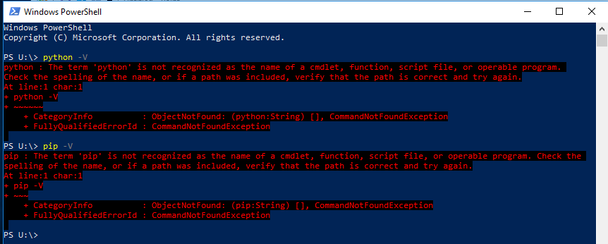
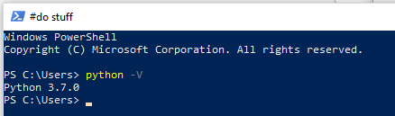

# Installing Python on your local machine

Instructions on how to install Python and make sure its in your PATH so you can run scripts.

## Objectives

* Have `python -V` or `python3 -V` return a `3.x.x` version of Python greater than 3.4.0
* Have the corresponding `pip -V` or `pip3 -V` also return a `3.x.x` version of Python greater than 3.4.0
* Successfully install ArchivesSnake

## Do I already have Python 3?

There are two main versions of Python, Python 2 and Python 3. We will be using Python 3, and there are very few reasons to still use Python 2.

If you are using macOS or a Linux distribution, you probably already have a version of Python installed, but it might be Python 3. If you are using Windows, chances are that you don't have Python installed unless you installed it yourself.

1. To check open a command line terminal. 

   * For macOS and Linux operative systems, this is the program called  "Terminal."

   * For Windows, you have a two main options that should already be installed (I suggest Powershell)

     * Powershell

     * Command Prompt (or cmd.exe)

2. Type `python -V` and press enter.

   * if you got one of these errors, you do not have Python installed:

     * `-bash: python: command not found` 

     *  `'python' is not recognized as an internal or external command` 

     * `python : The term 'python' is not recognized as the name of a cmdlet, function, script file, or operable program.`

     * if you got `Python 2.7.x` you have Python 2 installed

     * if you got `Python 3.x.x` , you have Python 3 installed

       * Make sure you have `Python 3.4.x` or later.

3. If you have Python 2, try typing `python3 -V` and press enter.

   * if you got one of these same errors you need to install Python 3:

     * -bash: python: command not found` 

     *  `'python' is not recognized as an internal or external command` 

     * `python : The term 'python' is not recognized as the name of a cmdlet, function, script file, or operable program.`

   * if you got `Python 3.x.x` , you have Python 3 installed

     * Make sure you have `Python 3.4.x` or later.

4. Check for pip by running `pip -V` and `pip3 -V`

   * Your version of pip should be the same as your Python version, so if your `python` or `python3` output is `3.7.2`, then your corresponding `pip` or `pip3` output should be `3.7`
   

### Examples

This macOS machine has Python 2, but *not* Python 3, so you need to install it

This Windows machine does not have Python or pip

This Windows machine does not have Python 3

This Windows machine has Python 3 using the `python` command

## Installing Python 3

### Windows Machines

1. Visit the Python download page at https://www.python.org/downloads/

2. Download the latest version of the Python installer for Windows

3. When using the the installer, make sure the "Add Python 3.7 to PATH" option is checked

4. Close all Powershell and Command Prompt windows and reopen one

5. Check for Python and Pip with `python -V` and `pip -V`

Success!

6. If you installed Python, but were still unable to use in in Powershell or the Command Prompt, you need to add it to your path

	* Follow the "Setting up Python" instructions here: https://practicaltechnologyforarchives.org/issue7_wiedeman/

	* The Path you need to add should be either:

		* C:\Users\\[USERNAME]\AppData\Local\Programs\Python\Python37-32

		* C:\Python37-32

### macOS Machines

### Option 1: Using the Terminal

1. Install Xcode if you don't already have it

   a. Check for Xcode by opening the terminal and typing `xcode-select -p` and hit enter

   b. If you get `/Library/Developer/CommandLineTools` you have Xcode and can skip the next steps

   c. Run `xcode-select --install`  to install Xcode. Select the **install** button and agree to install developer tools

   d. Repeat steps a & b

2. Install HomeBrew if you don't already have it

   a. Check for brew with `brew doctor`

   b. If you get `Your system is ready to brew.` you have HomeBrew and can skip the next steps

   c. Run `/usr/bin/ruby -e "$(curl -fsSL https://raw.githubusercontent.com/Homebrew/install/master/install)"` (You'll probably need to enter your user password.)

   d.  Repeat steps a & b 

3. Install Python 3

   * Run `brew install python3`
   
   * Check your Python and Pip versions with `python3 -V` and `pip3 -v`

### Option 2: Using the Installer

1. Visit the Python download page at https://www.python.org/downloads/

2. Download the latest version of the Python installer for macOS

3. Follow the instructions for a basic install

4. Check your Python and Pip versions in Terminal with `python3 -V` and `pip3 -v`

### Linux Machines

1. Use `sudo apt-get install python3` or `sudo yum install python3` depending on your distro

2. Check your Python and Pip versions with `python3 -V` and `pip3 -v`

## Install ArchivesSnake

* We will use ArchivesSnake to write scripts for ArchivesSpace

* To install ArchivesSnake with Pip, run either `pip3 install archivessnake` or `pip install archivessnake` depending on if you had an existing Python 2 install.

ArchivesSnake successfully installed on Windows

ArchivesSnake successfully installed on macOS

### Once `python -V` or `python3 -V` returns 3.x.x and ArchivesSnake installed successfully, you're done!